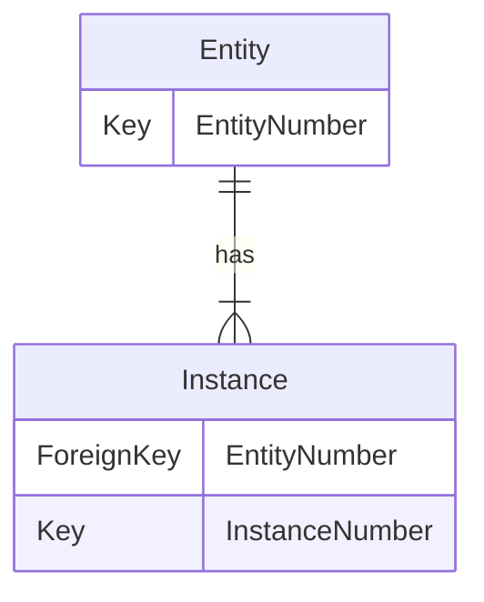
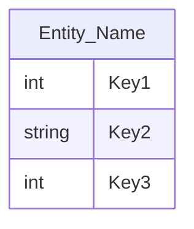

# 3-2. Entity
---
 

## 1. The Concept of Entity
  > An Entity is a collective thing, to be stored and managed through an IT system from a business perspective. 

- **The Scope of Entity**
  - Entities are ***nouns***; correspond to a *person, thing, concept*, etc.
  - Entities are ***points of interest*** that need to be managed through the system from a business point of view.
  - As a result, entities can become '***things***' that need to be stored to implement a business.
 

## 2. Relationship Between Entity and Instance
 > An entity can be thought of as a <u>set of instances</u>. An entity can have multiple instances.
 > So, the relationship between entities and instances becomes *1 : M*.

#### Expressed in ERD

#### Example
<table>
  <tr bgcolor="mediumseagreen">
    <td><b>Entity</td>
    <td><b>Instance</td>
  </tr>
  <tr>
    <td rowspan="2">Subway Station</td>
    <td>Gangnam st. Line 2</td>
  </tr>
  <tr>
    <td>Jamsil st. Line 8</td>
  </tr>
  <tr>
    <td rowspan="2">Cafe</td>
    <td>Starbucks Gangnam</td>
  </tr>
  <tr>
    <td>CoffeeBean Myeongdong</td>
  </tr>
</table>
 

## 3. Notation of Entities

 

## 4. Conditions for Entity

#### 1) Must be a piece of information that is necessary to satisfy business requirements, and needs to be stored and managed.
  - e.g. The patient entity is absolutely necessary in a hospital, but may not be necessary in a general company.

#### 2) Must be identifiable by a unique identifier. In other words, you should be able to pinpoint only one case in the set.
  - e.g. Subway_Station → Station_ID

#### 3) Must be a collection of two or more instances that exist permanently.
  - e.g. Subway_Station is a set of several subway stations, not one.

#### 4) Must be used by business processes.
  - e.g. New customers → Insert informations in Customer Entity
    > - An Entity should be removed if its status doesn't change by a business process. (e.g. Insert, Select, Update, Delete). 
    > - If the isolation of the entity is due to a missing process, the process needs to be added.

#### 5) Must have attributes.
  - e.g. Subway_Station → Name
    > - If an entity has only a name without an attribute, you might think that your business analysis is not good enough and relationship or attribute information is missing.

#### 6) Must have at least one relationship with another entity.
  - e.g. One Subway station is related to several boarding / alighting information.
 

***> Exception***
  > Exceptionally, due to the specificity of the system, even entities for which all attributes are not satisfied can be derived as entities.

 

## 5. Classification of Entities
> An entity can be classified according to **tangible / intangible** or **time of occurrence.** 
> Classification according to the tangible / intangible of an entity includes a <u>*type entity*</u>, a <u>*concept entity*</u>, and an <u>*event entity*</u> 
> Classification according to the point of occurrence includes a <u>*basic entity*</u>, a <u>*central entity*</u>, and an <u>*action entity*</u>***.

 

#### Based on Tangible - Intangible
<table>
  <tr bgcolor="mediumseagreen">
    <td><b>Division</td>
    <td><b>Example</td>
    <td><b>Explanation</td>
  </tr>
  <tr>
    <td>Type</td>
    <td>Employee, Product, Instructor</td>
    <td>A stable and continuous using entity that physically exists.</td>
  </tr>
  <tr>
    <td>Concept</td>
    <td>Organization, Insurance product</td>
    <td>An intangible entity that stores conceptual information managed in the business.</td>
  </tr>
  <tr>
    <td>Event</td>
    <td>Order, Billing, Non-payment</td>
    <td>An entity generated by doing business. 
        Produced a lot more than the type/concept entity, and can be used for various statistical data.</td>
  </tr>
</table>
 

#### Based on the Time of Occurrence
<table>
    <tr bgcolor="mediumseagreen">
    <td><b>Division</td>
    <td><b>Example</td>
    <td><b>Explanation</td>
  </tr>
  <tr>
    <td>Basic</td>
    <td>Employee, Department, Customer, Product, Material</td>
    <td>Information about the existence that born by itself in the business. 
    Can be created independently rather than by a relationship with other entities.</td>
  </tr>
  <tr>
    <td>Central</td>
    <td>Contract, Accident, Deposit ledger, Order, Billing, Sales</td>
    <td>Originates from a basic entity and plays a central role in business. 
    It is massively generated and it derives many behavioral entities from relationships with other entities.</td>
  </tr>
  <tr>
    <td>Action</td>
    <td>Order list, Employee change history</td>
    <td>Arises from multiple parent entities. 
        While processing various and complex businesses, the amount of data can be increased. 
        Action entities are derived during the detailed design stage or correlation modeling with the process.</td>
  </tr>
</table>
 

## 6. Naming Conventions for Entities

 - Whenever possible, use the terminology used by business personnel.
  
 - Avoid using abbreviations as much as possible.
  
 - The entity must be a singular noun.
  
 - An entity's name must be unique within its model.
  
 - Give the name according to the meaning of creation of the entity.

